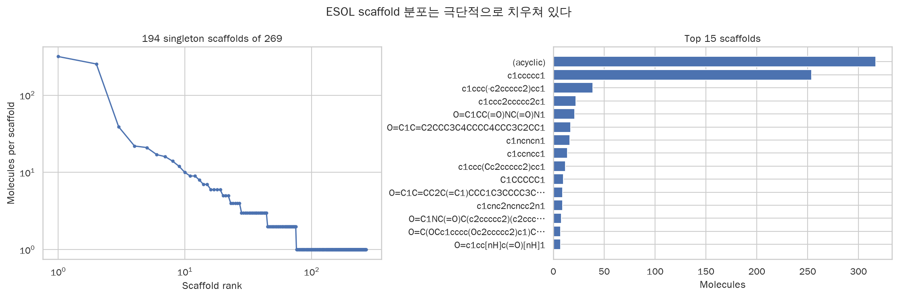
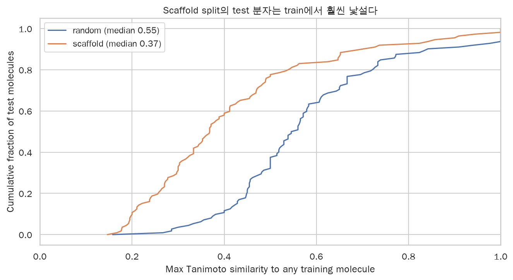
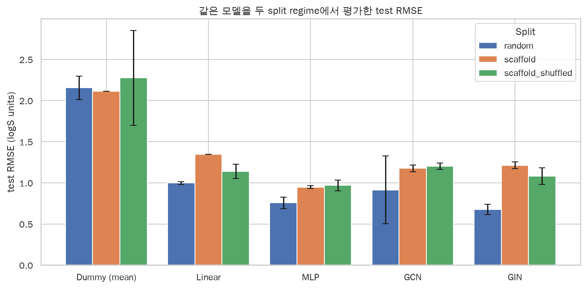
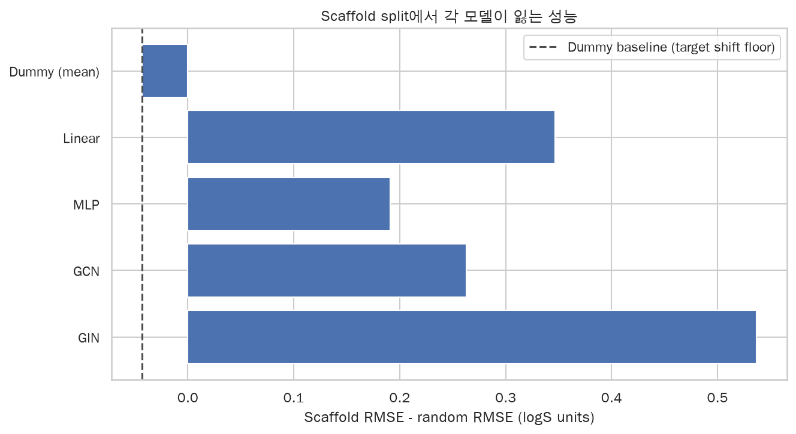
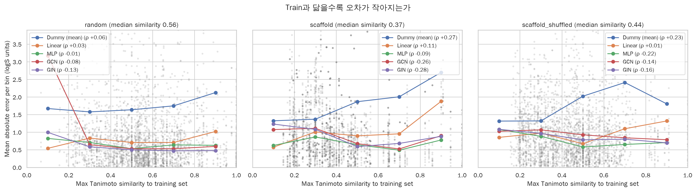

# 3주차: Random split은 GNN을 과대평가하는가?

## 1. 질문

2주차까지 우리는 random split 하나로만 평가했습니다. 그런데 ESOL 같은 molecular dataset에서는
train과 test에 같은 chemical scaffold가 동시에 들어가기 쉽습니다. 그러면 모델은 **거의 같은 골격을
이미 본 상태**에서 평가받게 됩니다.

> GNN이 물리적인 solubility relationship을 배운 것인가, 아니면 training set과 비슷한
> molecular motif를 memorization한 것인가?

이 질문에 답하기 위해 **완전히 같은 모델·같은 hyperparameter**를 두 split regime에서 평가했습니다.

| | Experiment A | Experiment B |
|---|---|---|
| Split | Random | Murcko scaffold (deterministic) |
| 관계 | train molecules ≈ test molecules | train scaffolds ∩ test scaffolds = ∅ |

## 2. 방법

- **모델**: 1주차 descriptor baseline 3종(`Dummy (mean)`, `Linear`, `MLP`)과 2주차 GNN 2종
  (`GCN`, bond-aware `GIN`). 새 아키텍처는 추가하지 않았고 hyperparameter도 2주차 값
  (`hidden=64`, `layers=3`, `dropout=0.2`, `max_epochs=150`, `patience=20`)을 그대로 썼습니다.
- **Scaffold 정의**: RDKit `MurckoScaffold.MurckoScaffoldSmiles`. Side chain을 떼고 ring system과
  linker만 남긴 2D framework입니다. benzene · toluene · phenol은 모두 `c1ccccc1`로 축약됩니다.
- **배정 규칙**: scaffold 그룹을 크기 내림차순(동률은 SMILES 오름차순)으로 정렬한 뒤, 매번
  **남은 자리가 가장 많은 subset**에 통째로 넣습니다. ESOL에서 정확히 train 902 / validation 113 /
  test 113이 나와 1·2주차 random split과 크기가 같습니다.
- **Acyclic 정책**: `acyclic_policy="group"`. ring이 없는 분자(scaffold가 빈 문자열)를 하나의 그룹으로
  묶는 DeepChem · MoleculeNet · OGB 관례입니다. 이 그룹이 가장 크므로 통째로 train에 들어가고,
  **결과적으로 test set에는 acyclic 분자가 한 개도 없습니다.** 이 대가는 §7에서 다시 다룹니다.
- **Seed**: 5개(0–4). 모든 (모델 × regime) 셀을 mean ± std로 보고합니다.
- **부록 regime**: `scaffold_shuffled`는 scaffold 제약을 지키면서 split을 seed마다 다시 뽑습니다.

**seed 표준편차가 regime마다 다른 것을 재는 점에 주의해야 합니다.**

| regime | seed가 바꾸는 것 | std의 의미 |
|---|---|---|
| `random` | split + 학습 | split noise + training noise |
| `scaffold` | 학습만 (split은 결정적) | **training noise만** |
| `scaffold_shuffled` | split + 학습 | scaffold 제약 하의 split 변동폭 |

그래서 `scaffold` 열의 std를 `random` 열의 std와 직접 비교하면 안 됩니다.

## 3. 데이터 특성: ESOL은 생각보다 훨씬 좁다

| 항목 | 값 |
|---|---|
| 분자 수 | 1,128 |
| 고유 Murcko scaffold | 269 |
| Acyclic 분자(빈 scaffold) | 317 (28.1%) |
| 가장 큰 ring scaffold `c1ccccc1` | 254 (22.5%) |
| Singleton scaffold | 194개 (분자의 17.2%) |

**상위 두 그룹이 데이터셋의 50.6%를 차지합니다.** 1,128개 분자가 있어도 골격은 몇 백 개뿐이고,
그중 둘이 절반입니다. Random split이 낙관적으로 보이는 구조적 이유가 여기 있습니다.

## 4. 두 test set은 애초에 다른 과제다

모델 결과를 보기 전에, split이 의도대로 잘렸는지부터 확인합니다.

| regime | test 분자 | test scaffold | train과 공유하는 scaffold | train scaffold를 가진 test 분자 |
|---|---|---|---|---|
| random | 113 | 39 | 26 | **100 (88.5%)** |
| scaffold | 113 | 83 | 0 | **0 (0%)** |
| scaffold_shuffled | 111 | 48 | 0 | 0 (0%) |

Random split에서는 test 분자의 **88.5%가 train에 이미 같은 골격을 가지고 있습니다.** Scaffold
split에서는 정의상 0입니다.

Morgan fingerprint(radius 2) 기준 **train에서 가장 비슷한 분자와의 Tanimoto similarity**로 보면
차이가 더 분명합니다.

| regime | similarity 중앙값 | similarity > 0.6인 test 분자 |
|---|---|---|
| random | 0.556 | 39.1% |
| scaffold | 0.368 | 16.8% |

### Target 분포는 어떻게 이동했나

Scaffold split은 난이도만 올리는 게 아니라 test set의 logS 분포 자체를 옮깁니다.

| regime | subset | logS 평균 | logS 표준편차 |
|---|---|---|---|
| random | train | −3.05 | 2.07 |
| random | test | −3.10 | 2.18 |
| scaffold | train | −2.92 | 2.08 |
| scaffold | test | **−3.55** | 2.02 |

평균이 0.6 logS 이동했습니다. 이 이동만으로도 RMSE가 오를 수 있으므로, 아래에서 `Dummy (mean)`을
통제군으로 씁니다.

## 5. 결과

Test RMSE, 5 seed mean ± std (단위: logS):

| Model | Representation | Random | Scaffold | Scaffold (shuffled) |
|---|---|---|---|---|
| Dummy (mean) | — | 2.155 ± 0.142 | 2.112 ± 0.000 | 2.275 ± 0.575 |
| Linear | RDKit descriptors | 0.998 ± 0.017 | 1.345 ± 0.000 | 1.139 ± 0.088 |
| **MLP** | RDKit descriptors | 0.756 ± 0.068 | **0.947 ± 0.017** | 0.968 ± 0.066 |
| GCN | Molecular graph | 0.914 ± 0.411 | 1.177 ± 0.041 | 1.203 ± 0.037 |
| **GIN** | Molecular graph | **0.677 ± 0.061** | 1.213 ± 0.042 | 1.082 ± 0.102 |

**순위가 뒤집힙니다.**

- Random split에서 **GIN이 1등**(0.677)이고 descriptor MLP는 2등(0.756)입니다.
  2주차의 단일 split 결과(MLP가 GIN을 근소하게 앞섬)와 달리, seed 5개를 평균하면 GIN이 분명히 앞섭니다.
- Scaffold split에서는 **descriptor MLP가 1등**(0.947)이고 GIN은 GCN보다도 뒤인 꼴찌 수준(1.213)입니다.

`Dummy (mean)`의 std가 `scaffold`에서 정확히 0인 것은 split과 모델이 모두 결정적이기 때문입니다
(`Linear`도 마찬가지). 이 두 행에서 `gap_over_pooled_std`는 발산하므로 읽지 않습니다.

## 6. Generalization gap

`gap = scaffold RMSE − random RMSE`:

| Model | Random | Scaffold | gap | gap ratio | **Dummy 대비 초과** |
|---|---|---|---|---|---|
| Dummy (mean) | 2.155 | 2.112 | **−0.043** | 0.98 | (기준선) |
| Linear | 0.998 | 1.345 | +0.347 | 1.35 | +0.390 |
| MLP | 0.756 | 0.947 | +0.191 | 1.25 | **+0.234** |
| GCN | 0.914 | 1.177 | +0.263 | 1.29 | +0.306 |
| GIN | 0.677 | 1.213 | **+0.537** | **1.79** | **+0.580** |

**통제군이 깨끗하게 나왔습니다.** `Dummy (mean)`의 gap은 **−0.043**, 즉 음수입니다. Scaffold test set은
평균만 예측하는 모델에게는 오히려 **아주 약간 쉽습니다**(logS 표준편차가 2.02로 random test의 2.18보다
작기 때문). 따라서 **§4에서 본 target 분포 이동은 실제 RMSE 증가를 설명하지 못합니다.** 다른 모델들이
잃은 성능은 전부 "새로운 골격으로 표현이 전이되지 않은 몫"입니다.

그 몫을 비교하면:

- **GIN의 초과 gap(+0.580)은 descriptor MLP(+0.234)의 약 2.5배입니다.**
- GIN의 scaffold std는 0.042 — gap이 training noise보다 한 자릿수 이상 큽니다.
- `scaffold_shuffled` 부록도 같은 방향입니다(GIN 1.082 vs MLP 0.968). 즉 이 결과는 **하나의 운 나쁜
  split 때문이 아닙니다.**

한 가지 정직하게 짚을 점: **GCN의 random split std가 0.411로 유난히 큽니다.** seed별로 보면
0.595 / 0.753 / **1.627** / 0.717 / 0.877로, seed 2 한 번의 실패한 학습이 평균과 std를 모두 끌어올렸습니다.
GCN의 random 수치는 그만큼 신뢰도가 낮습니다. GIN은 0.605–0.744로 안정적이므로 위 결론은 GIN에
기대는 것이 안전합니다.

## 7. 오차 분해: 비슷한 걸 봤을 때만 잘 맞추는가

여기가 핵심 증거입니다. test 분자마다 train과의 nearest-neighbour Tanimoto similarity를 계산해,
similarity가 낮아질수록 오차가 커지는지 봅니다.

Scaffold regime의 Spearman ρ(음수 = similarity가 높을수록 오차가 작다):

| Model | random | scaffold |
|---|---|---|
| Dummy (mean) | +0.062 | **+0.273** |
| Linear | +0.031 | +0.113 |
| MLP | −0.005 | −0.090 |
| GCN | −0.083 | −0.257 |
| GIN | −0.129 | **−0.281** |

`Dummy`의 ρ가 **양수(+0.273)**라는 사실이 중요합니다. Scaffold test set에서는 similarity가 높은 분자가
오히려 logS가 극단적인 어려운 분자들입니다. 즉 **내재적 난이도 기울기는 GNN에게 유리한 방향과
반대로 흐릅니다.** 그런데도 GNN의 ρ는 뚜렷하게 음수입니다.

이 내재적 난이도를 걷어내기 위해 각 similarity 구간에서 **모델 MAE ÷ Dummy MAE**를 봅니다
(1.0이면 평균 예측과 같고, 낮을수록 실력):

**Scaffold split**

| Model | ≤0.2 | 0.2–0.4 | 0.4–0.6 | 0.6–0.8 | >0.8 |
|---|---|---|---|---|---|
| Linear | 0.43 | 0.74 | 0.48 | 0.48 | 0.70 |
| MLP | **0.47** | **0.63** | 0.35 | 0.24 | 0.29 |
| GCN | 0.81 | 0.81 | 0.36 | 0.26 | 0.33 |
| GIN | **0.93** | **0.79** | 0.32 | 0.34 | 0.33 |
| (구간별 분자 수) | 65 | 270 | 135 | 50 | 45 |

**이것이 이번 주의 답입니다.**

- Similarity가 0.4를 넘는 구간(230개 분자)에서는 GNN이 descriptor MLP와 대등하거나 더 좋습니다
  (GIN 0.32–0.34 vs MLP 0.24–0.35).
- Similarity가 0.4 이하인 구간(**335개 분자, test의 59%**)에서 **GIN은 Dummy 대비 0.79–0.93 —
  사실상 평균 예측 수준으로 무너집니다.** GCN도 0.81입니다.
- 같은 구간에서 descriptor 모델은 실력을 유지합니다(MLP 0.47–0.63, Linear 0.43–0.74).

즉 GNN은 **"본 것과 닮았을 때만" 잘합니다.** logP · TPSA · MolWt 같은 물리적 descriptor는 골격이
바뀌어도 의미가 유지되지만, 학습된 graph representation은 익숙한 motif 밖으로 잘 전이되지 않습니다.

## 8. 한계

1. **Deterministic scaffold split은 단 하나의 실현입니다.** `scaffold` 열의 seed std는 학습 noise만
   포함합니다. `scaffold_shuffled` 부록이 split 변동폭을 보여주며 결론은 유지되지만, 완전한
   대체는 아닙니다.
2. **`acyclic_policy="group"` 때문에 test에 acyclic 분자가 0개입니다.** Test set이 ring 분자로만
   구성되므로, gap의 일부는 "memorization 실패"가 아니라 "chemotype 미포함"일 수 있습니다.
   다만 `Dummy` 통제군이 음수 gap을 보인 것은 이 편향이 RMSE를 부풀리지 않았음을 시사합니다.
3. **Hyperparameter는 2주차 random split에서 고른 값을 재조정 없이 썼습니다.** 의도적입니다 —
   regime마다 다시 튜닝하면 "같은 모델을 두 번 평가한다"는 실험 설계 자체가 무너집니다. 다만 GNN이
   scaffold regime에 맞게 정규화를 강화하면 gap이 줄어들 여지는 있습니다.
4. **Validation도 scaffold-disjoint입니다.** Early stopping 대상이 train과 다른 골격이라 model
   selection이 더 어렵습니다. 다만 validation RMSE에서도 같은 패턴이 나타나므로(GIN 0.633 → 0.984,
   MLP 0.737 → 0.954) early stopping 자체가 원인은 아닙니다.
5. **ESOL은 1,128개로 작고 test는 113개뿐입니다.** 특히 similarity 구간별 표에서 상위 구간은
   45–50개 수준이라 잡음이 있습니다.
6. **CUDA 연산은 완전히 결정적이지 않습니다.** 다른 GPU에서는 소수점 단위 재현이 근사적입니다.
   실행 환경은 `results/week3/summary.json`의 `environment`에 기록되어 있습니다.

## 9. 결론

Random split만 보면 GIN이 가장 좋은 모델입니다(RMSE 0.677). Scaffold split으로 바꾸면 GIN은
descriptor MLP에게 자리를 내주고(1.213 vs 0.947), 그 성능 하락은 target 분포 이동으로 설명되지
않습니다(`Dummy` gap −0.043).

오차 분해는 하락의 위치를 정확히 짚어 줍니다. GNN은 train에 닮은 분자가 있을 때는 강하지만,
Tanimoto similarity 0.4 이하 구간 — scaffold split test의 59% — 에서는 평균 예측 수준으로 무너집니다.
같은 구간에서 물리적 descriptor 기반 모델은 실력을 유지합니다.

**이 데이터셋과 이 모델 크기에서, GNN의 우위는 상당 부분 익숙한 molecular motif에 대한
memorization에서 옵니다.** 물리적 관계를 배우지 못했다고 단정할 수는 없지만, 배운 표현이 새로운
골격으로 전이되지 않는다는 것은 분명합니다.

### 다음 단계

- **Applicability domain**: nearest-neighbour similarity를 예측과 함께 보고해, 모델이 신뢰 구간
  밖에서 예측하고 있음을 사용자에게 알리기.
- **Uncertainty estimation**: ensemble이나 evidential regression으로 low-similarity 구간의
  불확실성을 실제로 크게 만들 수 있는지 확인.
- **Pretraining**: 훨씬 큰 unlabeled molecular corpus로 사전학습한 표현이 이 gap을 줄이는지 검증.
- **더 큰 데이터셋**: ESOL 1,128개는 scaffold 다양성이 근본적으로 부족합니다. AqSolDB 같은 더 큰
  용해도 데이터셋에서 같은 실험을 반복해야 결론이 일반화됩니다.

---

모든 수치는 `results/week3/`(`metrics.csv`, `predictions.csv`, `summary.json`)에서 나왔고,
`uv run python -m ai4sci_molecule.week3`로 재생성할 수 있습니다. 실험 과정은
[`notebooks/03_scaffold_split.ipynb`](../notebooks/03_scaffold_split.ipynb)에 있습니다.
