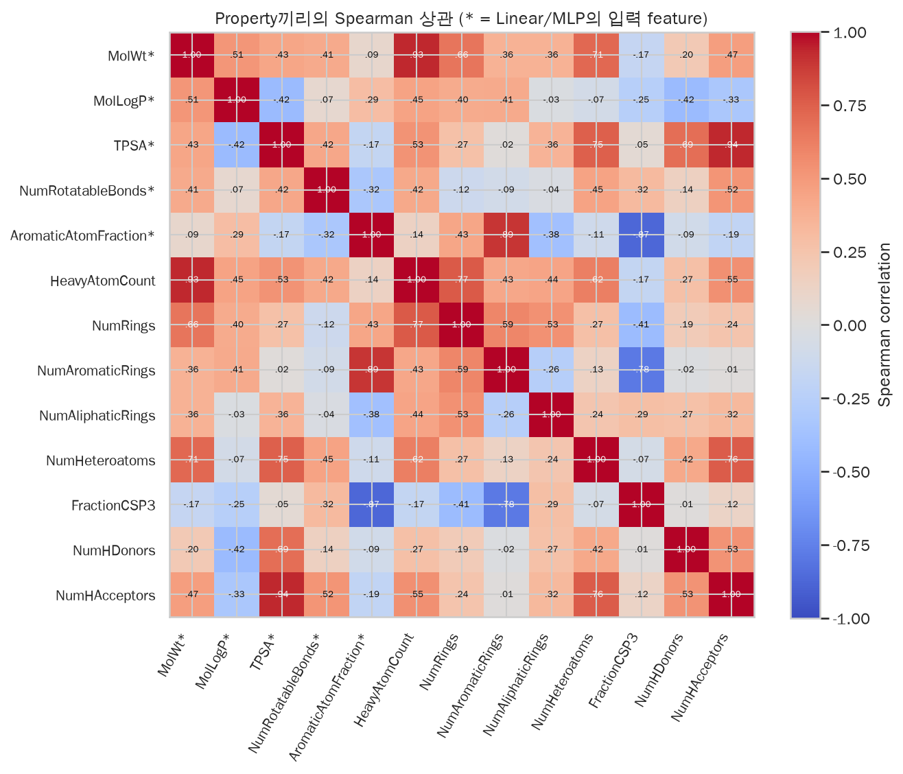
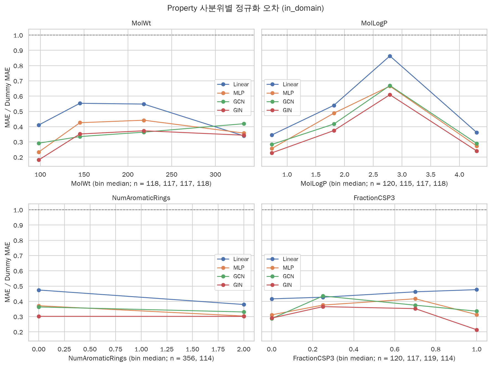
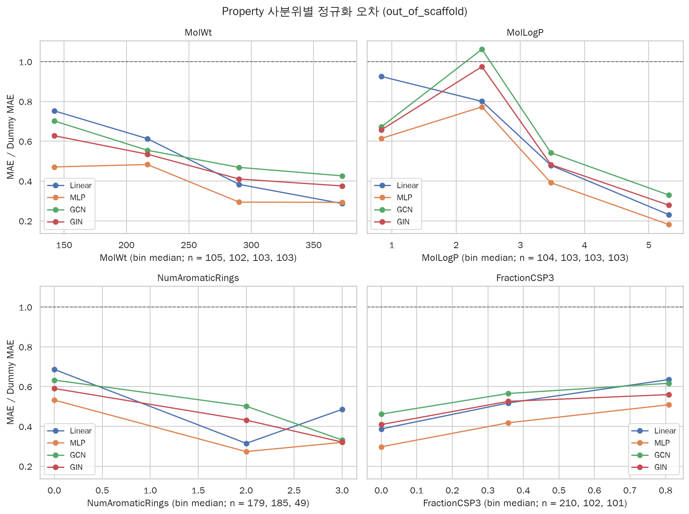
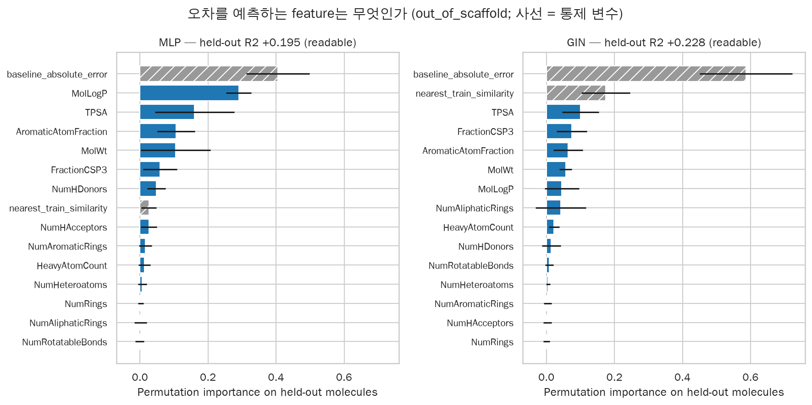
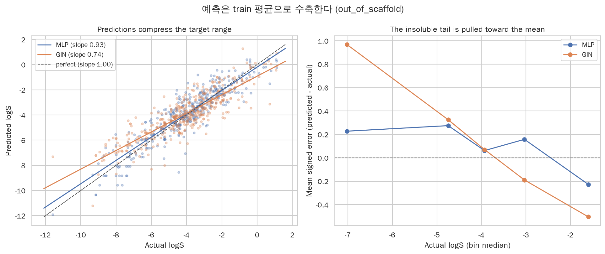
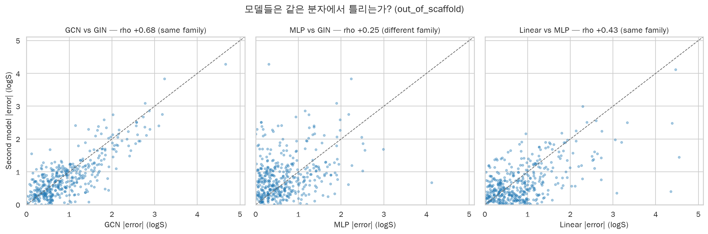
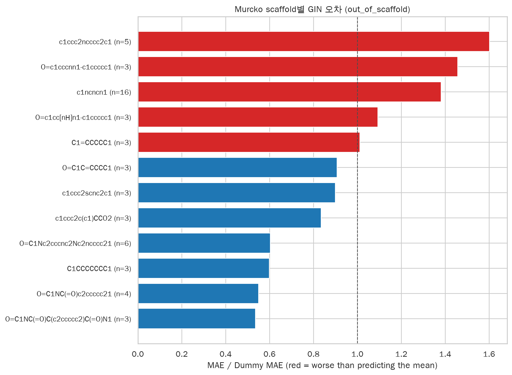
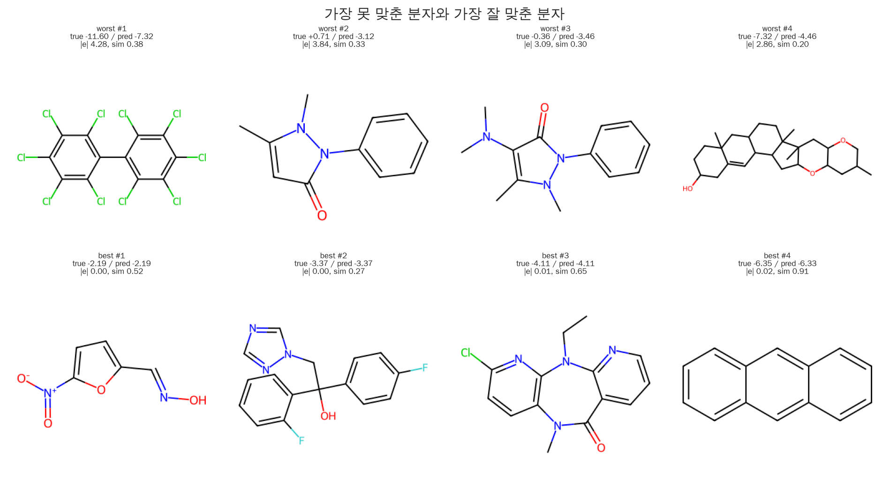

# 4주차: 모델은 어떤 분자에서 틀리는가?

## 1. 질문

3주차는 GNN이 **언제** 무너지는지 답했습니다. Nearest-train Tanimoto similarity가 0.4 아래로
내려가면 GCN/GIN은 `Dummy` 대비 0.79–0.93 — 사실상 평균 예측 수준으로 붕괴합니다. 답하지 않은
것은 그 다음 질문입니다.

> **어떤 분자에서** 틀리는가? 그리고 그 실패는 **어려운 화학** 때문인가, **표현 방식** 때문인가?

이번 주는 leaderboard를 떠납니다. 새 모델을 학습하지 않고, 3주차가 남긴 분자 단위 예측
$e_i = |\hat{y}_i - y_i|$ 를 molecular property와 대조해 **오차를 데이터에 대한 진단 도구**로 씁니다.

두 개의 가설을 미리 구분해 둡니다. 이 구분이 §7의 판정 기준입니다.

| | 예측 | 함의 |
|---|---|---|
| **H1** 어려운 분자 집합이 있다 | 모든 모델이 **같은** 분자에서 틀린다 | 어려운 화학 또는 label noise. 표현을 바꿔도 못 고친다 |
| **H2** 표현이 문제다 | 같은 표현끼리만 같은 분자에서 틀린다 | 표현 방식 고유의 약점. 고칠 여지가 있다 |

## 2. 방법

- **새 학습 없음.** 증거는 `results/week3/predictions.csv`(8,410행) 하나입니다. 이번 주 분석은
  torch를 import하지 않으며, 3주차 결과가 주어지면 **CPU에서 결정적으로** 재현됩니다.
- **13개 property.** 1주차 descriptor 5개(`MolWt`, `MolLogP`, `TPSA`, `NumRotatableBonds`,
  `AromaticAtomFraction`)를 그대로 재사용하고 8개(`HeavyAtomCount`, `NumRings`,
  `NumAromaticRings`, `NumAliphaticRings`, `NumHeteroatoms`, `FractionCSP3`, `NumHDonors`,
  `NumHAcceptors`)를 더합니다. 앞의 5개는 Linear/MLP의 **입력 feature**이기도 하므로 모든 표에
  `trained_on` 열로 순환성을 표시했습니다.
- **Seed 평균.** 분자 1행으로 축약합니다. `residual = predicted − actual`이므로 true −4.0을
  −1.7로 예측하면 residual은 **+2.3**(실제보다 잘 녹는다고 예측)입니다.
- **Regime pooling.** `random → in_domain`, `scaffold` + `scaffold_shuffled` →
  `out_of_scaffold`. 결정적 scaffold split 하나만 쓰면 test 분자가 113개, ≥3분자 scaffold가
  8개뿐입니다. 두 scaffold regime을 합치면 추가 학습 없이 413개 / 30개가 됩니다. `random`은
  leaky regime이므로 **섞지 않습니다.**
- **네 개의 통제 장치.**
  1. `Dummy (mean)`의 예측은 (split, seed)마다 train 평균 상수이므로 그 오차가 곧
     $|y - \bar{y}_{train}|$ — 분자별 **내재적 난이도**입니다. 이것을 `baseline_absolute_error`로
     쓰고, 구간별 집계는 모델 MAE ÷ Dummy MAE로 정규화합니다(3주차 §7의 기법). 모든 집계는
     **ratio-of-means**이고 분자별 비율의 평균은 쓰지 않습니다.
  2. 난이도와 nearest-train similarity를 통제한 **partial Spearman**을 함께 보고합니다.
  3. 다변량 모델은 **held-out $R^2$를 먼저** 계산하고, permutation importance는 held-out fold에서
     측정합니다. 통제 변수를 feature로 넣어 "property가 3주차의 similarity 이야기 *위에* 무엇을
     더하는가"를 묻습니다.
  4. 모든 상관에 bootstrap 95% CI(2,000회)를 붙이고, CI가 0을 제외하지 않은 값은 결론으로
     쓰지 않습니다.

## 3. 유효 표본 수: 8,410행은 8,410개의 관측이 아니다

| regime | split types | 분자 수 | seed 5개를 모두 가진 분자 | 분자당 평균 seed | scaffold | ≥3분자 scaffold |
|---|---|---|---|---|---|---|
| `in_domain` | random | 470 | 0 | 1.20 | 136 | 21 |
| `out_of_scaffold` | scaffold + scaffold_shuffled | 413 | 113 | 2.50 | 201 | 30 |

ESOL 1,128개 중 out-of-sample 예측이 존재하는 분자는 합집합 720개(64%)입니다. 그리고 seed 축의
의미가 regime마다 다릅니다. `out_of_scaffold`에서 seed 5개를 모두 가진 분자는 결정적 scaffold
split의 113개뿐이고, 나머지는 1–3개입니다. **대부분의 분자에서 per-molecule 오차는 학습 noise를
그대로 안고 있습니다.**

## 4. Property는 서로 독립이 아니다

|Spearman| > 0.6인 property 쌍이 12개입니다.

| A | B | ρ |
|---|---|---|
| TPSA | NumHAcceptors | **+0.94** |
| MolWt | HeavyAtomCount | **+0.93** |
| AromaticAtomFraction | NumAromaticRings | +0.89 |
| AromaticAtomFraction | FractionCSP3 | −0.87 |
| NumAromaticRings | FractionCSP3 | −0.78 |
| HeavyAtomCount | NumRings | +0.77 |



이 절이 먼저 오는 이유는 뒤에 나올 단일 상관을 **미리 반쯤 무효화**하기 위해서입니다. "MolWt에서
오차가 커진다"와 "HeavyAtomCount에서 오차가 커진다"는 서로 독립된 두 개의 발견이 아닙니다.
같은 축을 두 번 센 것입니다.

## 5. 익숙한 골격 안에서는 크기가 곧 약점이다

`in_domain`에서 GIN의 오차와 property의 Spearman ρ입니다. Dummy 열이 통제군입니다.

| property | ρ (GIN) | 95% CI | Dummy ρ | 난이도·similarity 통제 후 |
|---|---|---|---|---|
| HeavyAtomCount | **+0.275** | [+0.189, +0.361] | −0.028 | +0.300 |
| MolWt | **+0.265** | [+0.180, +0.352] | −0.055 | +0.292 |
| NumRings | +0.241 | [+0.153, +0.325] | +0.003 | +0.247 |
| NumHeteroatoms | +0.238 | [+0.152, +0.324] | −0.068 | +0.235 |
| NumAromaticRings | +0.222 | [+0.127, +0.310] | +0.020 | +0.218 |
| FractionCSP3 | **−0.174** | [−0.254, −0.082] | +0.018 | −0.170 |
| MolLogP | +0.106 | [+0.015, +0.194] | +0.046 | +0.142 |

**사용자의 질문에 대한 답이 여기 있습니다.** 익숙한 골격 안에서 GNN의 오차는 분자가 크고
ring이 많고 aromatic할수록 커지고, 포화된(`FractionCSP3` 높은) 분자에서는 작아집니다. 그리고
이것은 난이도 artifact가 아닙니다.

- **Dummy의 ρ는 전부 0 근처입니다**(|ρ| ≤ 0.12). 즉 큰 분자가 logS가 더 극단적이어서 오차가 큰
  게 아닙니다.
- **통제 후에도 값이 줄지 않습니다.** MolWt는 +0.265 → +0.292로 오히려 커집니다. 3주차의
  similarity 축으로 설명되는 부분이 아니라는 뜻입니다.

descriptor MLP도 같은 방향이지만 더 약합니다(HeavyAtomCount +0.243, MolWt +0.227).

난이도를 걷어낸 구간별 오차로 다시 확인합니다. GIN의 raw MAE는 MolWt 사분위를 따라
0.383 → 0.422 → 0.567 → 0.699로 **1.8배** 커지고, Dummy 대비 비율은 0.18 → 0.35 → 0.37 → 0.34로
커집니다.



## 6. 골격이 낯설어지면 property 축이 침묵한다

같은 표를 `out_of_scaffold`에서 보면 그림이 완전히 달라집니다.

| property | ρ (GIN) | 95% CI | Dummy ρ | 통제 후 |
|---|---|---|---|---|
| MolLogP | +0.103 | [+0.008, +0.200] | **+0.602** | +0.073 |
| TPSA | −0.082 | [−0.176, +0.014] | **−0.378** | −0.112 |
| NumHDonors | −0.074 | [−0.172, +0.022] | **−0.375** | −0.052 |
| MolWt | +0.064 | [−0.038, +0.162] | +0.291 | −0.020 |
| HeavyAtomCount | +0.005 | [−0.093, +0.096] | +0.188 | −0.050 |

**Dummy 정규화 없이는 정반대로 읽게 되는 지점입니다.** GIN의 property 상관은 13개 중 12개가
CI 안에 0을 포함합니다. 순진하게 보면 "property와 오차는 무관하다"가 됩니다.

그런데 `Dummy` 열을 보면 이 test set에는 뚜렷한 난이도 기울기가 **존재합니다**. logP가 높은
분자는 잘 안 녹아 평균에서 멀고(ρ +0.60), 극성이 크거나 H-donor가 많은 분자는 평균에 가깝습니다
(−0.38). 난이도가 이렇게 크게 변하는데도 GIN의 오차는 변하지 않습니다. 즉 **GIN은 쉬운 곳에서도
어려운 곳에서도 똑같이 나쁩니다** — 3주차의 "평균 예측 수준으로 붕괴"를 property 축에서 다시
본 것입니다.

그 결과 정규화된 오차는 MolWt에 대해 오히려 **감소**합니다(0.63 → 0.53 → 0.41 → 0.38). 큰 분자
쪽의 과제가 훨씬 어려워지기 때문입니다(Dummy MAE 1.36 → 2.67). §5의 크기 페널티는
**in-domain 현상**이고, 골격이 낯설어지면 novelty에 묻힙니다.



## 7. 다변량: property는 similarity 위에 무엇을 더하는가

13개 property가 서로 겹쳐 있으니 단일 상관만으로는 부족합니다. `|error|`를 예측하는 gradient
boosting 모델을 두 번 적합했습니다.

| regime | model | $R^2$ (property만) | $R^2$ (+ 난이도 · similarity) |
|---|---|---|---|
| in_domain | GIN | +0.079 | +0.126 |
| in_domain | MLP | +0.080 | +0.241 |
| out_of_scaffold | GIN | +0.082 | +0.228 |
| out_of_scaffold | MLP | +0.125 | +0.195 |

**8개 조합 모두 $R^2 > 0$이므로 순위를 읽어도 됩니다.** 다만 크지는 않습니다. Property만으로는
오차 분산의 8–13%밖에 설명하지 못합니다.

그리고 어느 feature가 그 설명력을 만드는지가 §5–§6의 대비를 그대로 반복합니다.

| regime | GIN의 상위 feature |
|---|---|
| `in_domain` | **MolWt 0.153** > 난이도 0.134 > similarity 0.123 > TPSA 0.051 |
| `out_of_scaffold` | **난이도 0.587** > **similarity 0.174** > TPSA 0.100 > FractionCSP3 0.074 |

익숙한 골격 안에서는 분자 크기가 두 통제 변수를 **앞섭니다** — 크기는 GNN에게 난이도나 novelty로
환원되지 않는 고유한 약점입니다. 골격이 낯설어지면 통제 변수 두 개가 상위를 독점하고 property는
뒤로 밀립니다.



## 8. 평균으로 수축한다 — 그리고 graph 모델이 더 심하다

부호를 보면 별개의 진단이 나옵니다. `predicted ≈ slope × actual`을 적합했습니다.

| regime | model | slope | 예측 std / 실제 std | 저용해도 구간 bias | 고용해도 구간 bias |
|---|---|---|---|---|---|
| in_domain | GIN | 0.867 | 0.914 | +0.428 | −0.263 |
| in_domain | MLP | 0.860 | 0.918 | +0.501 | −0.318 |
| out_of_scaffold | GIN | **0.738** | 0.856 | **+0.861** | −0.399 |
| out_of_scaffold | GCN | **0.687** | 0.826 | **+1.032** | −0.471 |
| out_of_scaffold | MLP | 0.927 | 1.017 | +0.197 | −0.090 |
| out_of_scaffold | Linear | 0.879 | 1.017 | +0.580 | +0.096 |

모든 기울기가 1보다 작고, 저용해도 구간 bias는 양수 · 고용해도 구간은 음수입니다.
**잘 안 녹는 분자는 실제보다 잘 녹는다고 예측합니다.** 사용자가 든 예 — true −4.0, pred −1.7 —
는 예외적 outlier가 아니라 이 기울기의 당연한 결과입니다.

**그리고 regime을 바꿨을 때 graph 모델만 무너집니다.** GIN 0.867 → 0.738, GCN 0.820 → 0.687인
반면 descriptor 모델은 거의 그대로입니다(MLP 0.860 → 0.927, 예측 std 비율은 1.02로 오히려 범위를
유지). logP·TPSA 같은 물리 descriptor는 골격이 바뀌어도 단조 관계가 유지되므로 외삽이 되는데,
학습된 graph representation은 낯선 골격에서 신호를 잃고 train 평균으로 후퇴합니다.



## 9. 핵심 결과: 같은 표현끼리 같은 분자에서 틀린다

이번 주의 판정입니다. `out_of_scaffold`에서 분자별 |error|의 Spearman 상관입니다.

| 쌍 | 같은 family | ρ | 95% CI | 최악 10% 공유 |
|---|---|---|---|---|
| GCN ↔ GIN | ✔ graph | **+0.679** | [+0.612, +0.736] | **0.756** |
| Linear ↔ MLP | ✔ descriptor | +0.434 | [+0.348, +0.515] | 0.512 |
| MLP ↔ GIN | ✘ | +0.254 | [+0.154, +0.342] | 0.268 |
| MLP ↔ GCN | ✘ | +0.194 | [+0.097, +0.289] | 0.244 |
| Linear ↔ GIN | ✘ | +0.173 | [+0.075, +0.268] | 0.268 |
| Linear ↔ GCN | ✘ | +0.071 | [−0.027, +0.169] | 0.195 |

같은 family 평균 **+0.557**, 교차 family 평균 **+0.182**. 세 배 차이입니다.

**답은 H2입니다.** 만약 "어려운 분자"라는 보편적 집합이 있다면 모든 쌍의 상관이 비슷해야 합니다.
GCN과 GIN은 최악 10% 분자의 **76%를 공유**하는데 MLP와 GIN은 27%만 공유합니다. 실패는 분자에
있는 게 아니라 **표현 방식에 묶여 있습니다.**



어디서 갈리는지도 화학적으로 읽힙니다.

**MLP가 이기는 분자** — 염소가 많이 붙은 고-logP 분자들입니다. Decachlorobiphenyl(logP 9.89,
true −11.60)에서 MLP 오차는 0.31인데 GIN은 **4.28**입니다. DDT 계열(logP 5.93)도 0.13 대 2.51.
descriptor 모델은 "logP가 극단적으로 크면 녹지 않는다"는 **단조 물리 규칙을 그대로 외삽**할 수
있고, GNN은 그 골격을 본 적이 없으면 평균 쪽으로 물러섭니다.

**GIN이 이기는 분자** — fused polycyclic과 당·steroid glycoside입니다. 5개의 aromatic ring을 가진
분자(MolWt 527)에서 MLP 4.12 대 GIN 0.67, 배당체(MolWt 457, logP −3.11)에서 2.17 대 0.61.
여기서는 graph topology가 실제로 정보를 더합니다.

즉 두 표현은 **상보적**입니다.

## 10. Scaffold 단위로 무너지는 곳

`out_of_scaffold`에서 ≥3분자인 scaffold 30개 중 GIN이 평균 예측보다 못한(정규화 오차 > 1.0)
scaffold가 **5개**입니다.

| scaffold | 분자 수 | GIN MAE | Dummy MAE | 정규화 | MLP 정규화 |
|---|---|---|---|---|---|
| `c1ccc2ncccc2c1` (quinoline) | 5 | 1.156 | 0.722 | **1.60** | 1.01 |
| `O=c1cccnn1-c1ccccc1` | 3 | 0.905 | 0.622 | **1.46** | 0.31 |
| `c1ncncn1` (triazine) | 16 | 1.098 | 0.795 | **1.38** | **1.60** |
| `O=c1cc[nH]n1-c1ccccc1` | 3 | 3.094 | 2.832 | 1.09 | 0.63 |
| `C1=CCCCC1` | 3 | 0.651 | 0.644 | 1.01 | 0.90 |

MLP는 30개 중 2개만 1.0을 넘습니다. 두 모델이 함께 무너지는 것은 `c1ncncn1`(triazine, 16개)
하나뿐이며 — §9의 논리대로 — 이 골격은 **화학 자체가 어려운** 후보입니다. 나머지는 GIN에서만
무너집니다.



## 11. 분자 A와 분자 B

가장 못 맞춘 분자와 가장 잘 맞춘 분자입니다. "가장 잘 맞춘" 쪽은 난이도가 0.25 logS 이상인
분자로 제한했습니다 — 그러지 않으면 train 평균에 앉아 있는 분자만 뽑혀 아무것도 배울 수 없습니다.

| | SMILES | true | pred | \|e\| | 난이도 | similarity | MolWt | logP |
|---|---|---|---|---|---|---|---|---|
| 최악 1 | `Clc1c(Cl)c(Cl)c(c(Cl)c1Cl)c2c(Cl)c(Cl)c(Cl)c(Cl)c2Cl` | −11.60 | −7.32 | **4.28** | 8.85 | 0.385 | 498.7 | 9.89 |
| 최악 2 | `Cc1cc(=O)n(c2ccccc2)n1C` | +0.72 | −3.12 | 3.84 | 3.64 | 0.325 | 188.2 | 1.48 |
| 최악 4 | `C1C(O)CCC2(C)CC3CCC4(C)C5(C)CC6OCC(C)CC6OC5CC4C3C=C21` | −7.32 | −4.46 | 2.86 | 4.42 | 0.201 | 414.6 | 5.51 |
| 최선 4 | `c1ccc2cc3ccccc3cc2c1` (anthracene) | −6.35 | −6.33 | 0.02 | 3.62 | **0.909** | 178.2 | 3.99 |
| 최선 3 | `CCN2c1nc(Cl)ccc1N(C)C(=O)c3cccnc23` | −4.11 | −4.11 | 0.01 | 1.11 | 0.652 | 288.7 | 2.88 |

패턴이 명확합니다. 최악 분자들은 **similarity 0.20–0.39**의 극단적 분자(logP 9.89, 또는 반대로
평균보다 잘 녹는 pyrazolone)이고, 최선 분자들은 **similarity 0.42–0.91**로 train에 닮은 분자가
있으면서도 난이도는 낮지 않은 분자들입니다. Anthracene은 logS −6.35라는 어려운 값을 오차 0.02로
맞히는데, train에 거의 같은 골격(similarity 0.91)이 있기 때문입니다.



## 12. 한계

1. **효과 크기가 작습니다.** §5의 ρ는 0.17–0.28이고, property만으로 오차 분산을 설명하는
   비율은 8–13%입니다. Property는 오차의 *일부*만 설명하며, 지배적 축은 여전히 3주차의
   scaffold novelty입니다(§7에서 난이도·similarity가 GIN importance의 상위를 독점).
2. **다중비교.** property 13개 × 모델 5개 × regime 2개 = 130개 상관입니다. α=0.05라면 우연히
   7개 정도가 유의해 보입니다. 족별(family-wise) 보정은 하지 않았습니다. 대신 bootstrap CI를
   붙이고, **날것의 ρ · partial ρ · 구간별 정규화 세 검사를 모두 통과하지 않은 값은 결론으로
   쓰지 않았습니다.** §5의 크기 효과는 세 검사를 모두 통과합니다.
3. **Property가 서로 겹칩니다.** `MolWt`/`HeavyAtomCount`/`NumRings` 안에서의 순위는 정보가
   없습니다. Permutation importance는 collinear feature 사이에 기여를 임의로 나눕니다.
4. **Pooling의 대가.** `scaffold`와 `scaffold_shuffled`를 합치면 같은 분자가 서로 다른 train
   set으로 학습된 모델에서 평가됩니다. 113개 대신 413개를 얻는 대가입니다. 결정적 113개 regime의
   숫자도 `results/week4/` 표에 함께 있습니다.
5. **Seed 커버리지가 고르지 않습니다.** `in_domain`의 분자당 평균 seed는 1.20,
   `out_of_scaffold`는 2.50입니다. 대부분의 분자는 단일 학습 실행의 noise를 그대로 안고 있고,
   결정적 scaffold split의 113개만 5회 평균입니다.
6. **Linear/MLP의 상관은 부분적으로 순환적입니다.** 13개 중 5개는 그 모델들의 입력 feature
   입니다(`trained_on` 열). §7에서 MLP의 최상위 property가 `MolLogP`인 것은 이 순환성과
   분리할 수 없습니다. GIN이 주 진단 대상이고 MLP는 대조군인 이유입니다.
7. **`acyclic_policy="group"` 때문에 out-of-scaffold test에 acyclic 분자가 없습니다**(3주차에서
   물려받은 제약). `FractionCSP3`와 `NumRings`가 가장 정보를 줄 구간이 잘려 있습니다.
8. **`|error|`는 model error와 label noise를 구분하지 못합니다.** ESOL의 측정 logS에도 수십 분의
   1 log unit 수준의 실험 오차가 있습니다. 모든 모델이 함께 틀리는 분자는 label이 틀렸을 수도
   있고, §9의 일치도가 이를 재는 가장 가까운 대리 지표입니다. `c1ncncn1`은 그 후보입니다.
9. **Scaffold 결과는 30개 scaffold, 대부분 3–5분자에 기반합니다.** 분자 하나가 잘못된 label을
   가지면 그 scaffold의 MAE가 크게 움직입니다. §10의 3분자 scaffold들은 특히 약합니다.
10. **새 실험을 하지 않았으므로 어떤 가설도 *검증*하지 못했습니다.** §8의 shrinkage 진단이나
    §9의 상보성은 모두 관찰이며, 개선책을 테스트한 것이 아닙니다.

## 13. 결론

**GNN의 오차는 분자에 있지 않고 표현에 있습니다.** 같은 표현을 쓰는 GCN과 GIN은 최악 분자의
76%를 공유하지만(ρ +0.679), 표현이 다른 MLP와 GIN은 27%만 공유합니다(ρ +0.254). "어려운 분자"라는
보편적 집합으로는 이 비대칭을 설명할 수 없습니다.

그 표현의 약점은 두 가지 얼굴을 가집니다. 익숙한 골격 안에서는 **분자 크기**입니다 — GIN의 오차는
MolWt와 ρ +0.265로 상관하고(Dummy는 −0.055), 난이도와 similarity를 통제해도 +0.292로 남으며,
다변량 모델에서 두 통제 변수를 앞섭니다. 골격이 낯설어지면 property 축은 침묵하고 novelty가
전부를 지배합니다.

세 번째 진단은 모델과 무관하게 작동합니다. 모든 모델이 **평균으로 수축**하며, regime을 바꿨을 때
graph 모델만 크게 나빠집니다(GIN 0.867 → 0.738, MLP 0.860 → 0.927). 물리 descriptor는 골격이
바뀌어도 단조성이 유지되어 외삽되지만, 학습된 graph representation은 그렇지 않습니다.

**실용적 결론:** 이 데이터셋과 이 모델 크기에서 두 표현은 상보적입니다. Descriptor 모델은
극단적 logP를 외삽하고, graph 모델은 fused polycyclic·glycoside 같은 복잡한 topology를 읽습니다.
어느 하나를 고르는 대신 둘을 함께 쓰고, similarity와 함께 **분자 크기**를 applicability domain의
축으로 보고해야 합니다.

### 다음 단계

- **Shrinkage를 직접 공격하기**: 저용해도 tail에 가중치를 주거나 target을 변환해 기울기 0.74가
  1에 가까워지는지, 그리고 그것이 RMSE를 실제로 개선하는지 확인.
- **두 표현의 앙상블**: §9가 두 family의 오차가 거의 독립임을 보여 주므로, descriptor 모델과
  graph 모델을 결합하면 단순 평균만으로도 이득이 나야 합니다. 나오지 않으면 §9의 해석이 틀린
  것이므로 좋은 검증입니다.
- **Atom-level attribution**: GNNExplainer나 Integrated Gradients로 GIN이 큰 분자에서 *어느
  부분구조* 때문에 틀리는지 확인. §5의 크기 효과가 pooling 단계의 정보 희석인지 확인하는 길입니다.
- **Label noise 분리**: 모든 모델이 함께 틀리는 분자들(`c1ncncn1` 포함)을 AqSolDB 같은 독립
  데이터셋과 교차 확인.
- **Out-of-fold 확장**: k-fold로 1,128개 전부에 out-of-sample 예측을 만들면 §7의 $R^2$가 표본
  수에 제약된 것인지 판단할 수 있습니다. `run_error_analysis`는 `predictions` 프레임만 받으므로
  같은 스키마를 넘기면 재작성 없이 확장됩니다.

---

모든 수치는 `results/week4/`에서 나왔습니다: `property_error_correlations.csv`(§5·§6),
`property_bins.csv`(§5·§6), `property_importance.csv`(§7), `shrinkage.csv`(§8),
`model_agreement.csv`·`model_disagreement.csv`(§9), `scaffold_errors.csv`(§10),
`case_studies.csv`(§11), `effective_sample_sizes.csv`(§3), `property_collinearity.csv`(§4),
`properties.csv`·`property_reference.csv`, `figures/*.png`. `summary.json`에 이 문서의 모든 표가
그대로 들어 있습니다. 분자 단위 `molecule_errors.csv`는 1.1 MB로 커밋하지 않으며(3주차
`predictions.csv`와 같은 이유), 입력인 `results/week3/predictions.csv`도 `.gitignore` 대상입니다.
둘 다 아래 명령으로 재생성됩니다.

```bash
uv run python -m ai4sci_molecule.week4
```

3주차 캐시가 있으면 CPU에서 1분 이내에 끝나고, 없으면 3주차 sweep을 먼저 돌립니다(GPU 약 10분).
이번 주 분석은 학습을 하지 않으므로 `summary.json`의 `environment`에는 torch/CUDA 대신
Python 3.13.7 · numpy 2.5.2 · pandas 3.0.5 · scikit-learn 1.9.0 · RDKit 2026.03.5가 기록되어
있습니다. 실험 과정은 [`notebooks/04_error_analysis.ipynb`](../notebooks/04_error_analysis.ipynb)에
있습니다.
